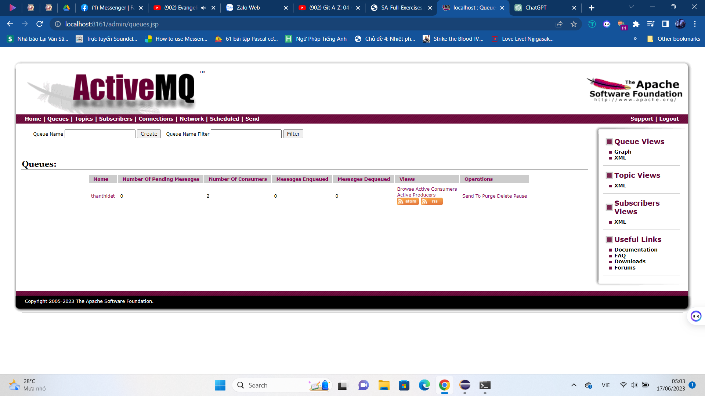

# `KIẾN TRÚC VÀ THIẾT KẾ PHẦN MỀM`
## Họ tên sinh viên: Nguyễn Xuân An
## Mã số sinh viên: 20065161
*[Github Nguyễn Xuân An](https://github.com/NguyenXuanAn5161)*
- **Các bài tập thực hành**
  - *Thực hành tuần 1 ActiviMQ*
  - *Thực hành tuần 2 ActiviMQ With javaFX*
  - *Thực hành tuần 3 java with redis*
  - *Thực hành tuần 5 SpringBoot*
  - *Thực hành tuần 6 SpringBoot*
***

*[Link tham khảo viết file readme.md](https://github.com/hocchudong/thuctap032016/blob/master/README.md#taobang)*
***
[Chuyển đến đây](#kiến-trúc-và-thiết-kế-phần-mềm)
